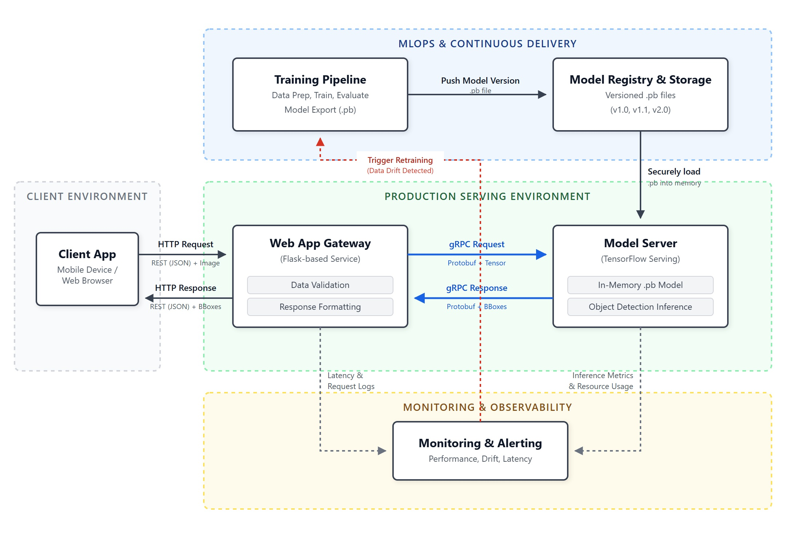

# WildlifeDetect

**Live Project**: https://struthious-porously-thomasina.ngrok-free.dev/od-frontend/

A production-ready machine learning system for wildlife detection using Faster R-CNN. Detect lions, ostriches, and oryxes in images with a modern web interface, integrated monitoring, and containerized deployment.

## Features

- **Wildlife Detection**: Fine-tuned Faster R-CNN model for detecting three African wildlife species
  - Lion
  - Ostrich
  - Oryx
- **Modern Web Interface**: Frontend with drag-and-drop image upload
- **Real-time Inference**: TensorFlow Serving with REST and gRPC APIs
- **Production Monitoring**: Prometheus metrics collection and Grafana visualization dashboards
- **Container Orchestration**: Full Docker Compose setup for easy deployment
- **Model Versioning**: Integrated model registry with version management
- **Confidence Scoring**: Built-in model drift monitoring with confidence metrics

## Architecture



## Quick Start

### Prerequisites

- **Docker** & **Docker Compose** (v1.29+)
- **Git**
- At least 4GB available disk space

### Installation & Deployment

1. **Clone the repository**
   ```bash
   git clone git@github.com:scaihai/ai-wildlife-detect.git
   cd ai-wildlife-detect
   ```

2. **Build and start services**
   ```bash
   docker-compose up -d --build
   ```

   This will:
   - Build and start the Flask frontend on http://localhost:5000
   - Start TensorFlow Serving on ports 8500 (gRPC) and 8501 (REST)
   - Build and start the training pipeline container
   - Launch Prometheus metrics collector on http://localhost:9090
   - Launch Grafana dashboards on http://localhost:3000

3. **Stop services**
   ```bash
   docker-compose down
   ```

## Usage

### Web Interface

1. Navigate to http://localhost:5000
2. Upload an image by:
   - Clicking "Select Image" button, or
   - Dragging and dropping an image onto the interface
3. The model processes the image and displays:
   - Detected animals with bounding boxes
   - Confidence scores for each detection
   - Detection statistics

### Supported Image Formats

- JPEG (.jpg, .jpeg)
- PNG (.png)

## Monitoring

### Prometheus

Prometheus automatically collects metrics from:
- TensorFlow Serving model performance
- Prediction confidence scores
- Inference latency
- Error rates

**Query Examples**:
```promql
# Average prediction confidence
avg(prediction_confidence_score)

# Inference latency
histogram_quantile(0.95, model_latency_seconds)
```

### Grafana

Pre-configured dashboard: `TF Serving Metrics`
- Accessible at: http://localhost:3000/d/ads2txc/tf-serving-metrics

**Key Metrics Visualized**:
- Model inference latency
- Prediction confidence distribution
- Request throughput
- Error rates and model health

## Configuration

### Model Configuration

- **Model Name**: `my_frcnn`
- **Model Version**: `4` (versioning in `model-registry/my_frcnn/`)
- **Framework**: TensorFlow 2.x
- **Architecture**: Faster R-CNN with ResNet101 backbone
- **Species**: Lion, Ostrich, Oryx

## API Documentation

### Flask Backend Endpoints

| Endpoint | Method | Description |
|----------|--------|-------------|
| `/` | GET | Serves the web interface |
| `/predict` | POST | Inference endpoint (accepts base64 image) |
| `/info` | GET | Model metadata and version info |
| `/metrics` | GET | Prometheus metrics |

### TensorFlow Serving

**Model Status**: `http://localhost:8501/v1/models/my_frcnn`

**Prediction**: `http://localhost:8501/v1/models/my_frcnn:predict`

## Dependencies

### Frontend
- Flask 3.0.3
- TensorFlow Serving (Docker image)
- Prometheus client library
- Pillow (image processing)
- NumPy (numerical operations)

### Infrastructure
- Docker Engine 20.10+
- Docker Compose 1.29+
- Prometheus 2.x
- Grafana 9.x

See `frontend/requirements.txt` for full Python dependencies.

## Author

Created by Destiny Gogo-fyneface as part of Enterprise Machine Learning coursework.
